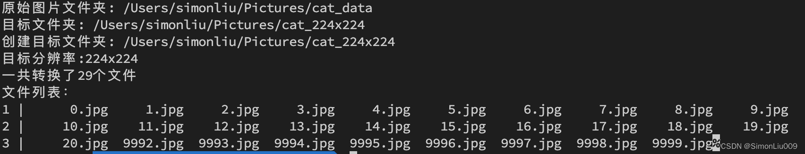

A Python script that resizes a image from center by custom ratio and size。
按照指定大小和比例居中裁剪和缩放图片的Python脚本。

效果(Screen shot of the result):


It shows the original image folder, target folder, target resolution, file count of converted pictures and file list after running the script.

运行完毕后,会显示原始图片文件夹，目标文件夹，目标分辨率，转换文件数量，以及转换的文件列表。


依赖(Dependencies):
```
numpy==1.22.3
opencv-contrib-python==4.5.5.64
pathlib==1.0.1
Pillow==9.1.0
```
